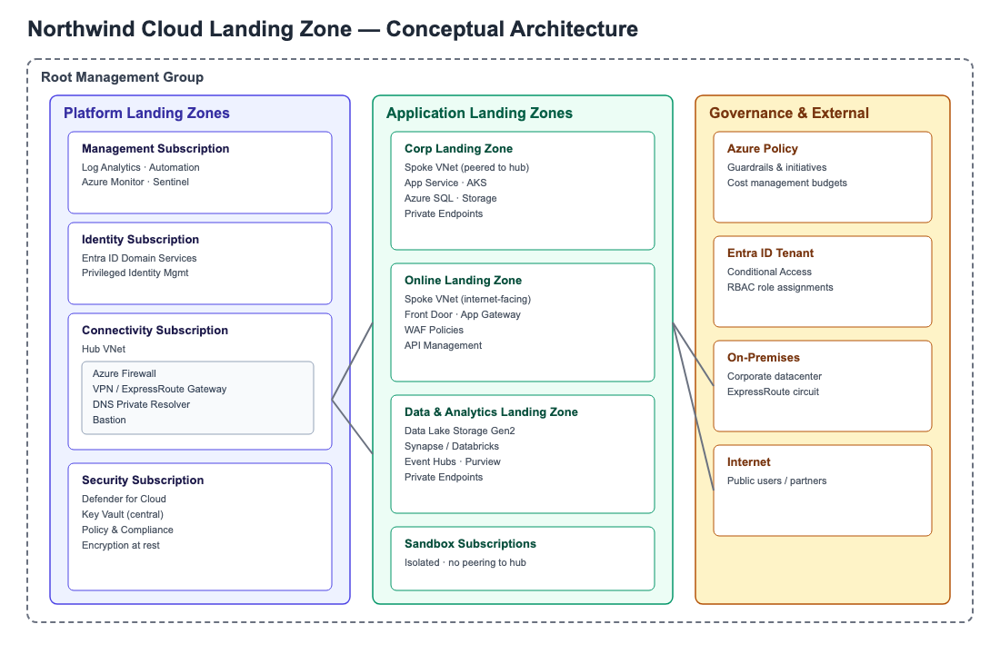
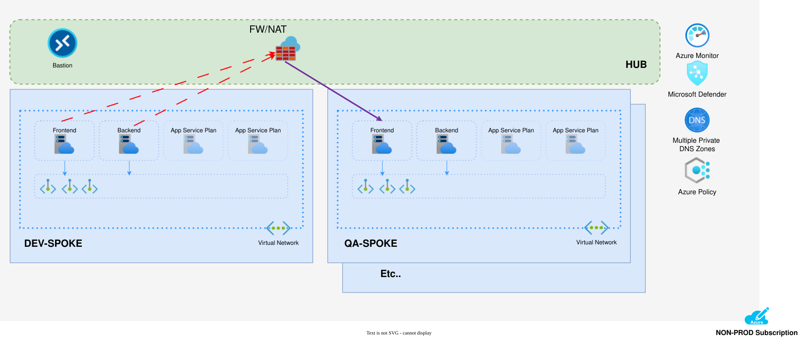

# 1. Architecture Overview

This section describes the conceptual design of the Northwind Systems cloud landing zone, a governed multi-subscription environment built to host platform services, application workloads, and data & analytics estates in a consistent, compliant manner.

## 1.1 Purpose and Scope

The landing zone establishes the foundational subscriptions, networking topology, identity boundaries, and governance guardrails required before any workload is onboarded. It is intended for use by platform engineering, security, and application delivery teams.

### 1.1.1 In Scope

Management group hierarchy, hub-and-spoke networking, centralized identity and security services, and policy-driven governance across all subscriptions.

### 1.1.2 Out of Scope

Application-level architecture, data models, and workload-specific CI/CD pipelines are covered in separate solution-level design documents.

## 1.2 Conceptual Diagram

Figure 1 illustrates the high-level landing zone topology, showing the platform, application, and governance layers and their relationships to on-premises and internet boundaries.

{width="6.458333333333333in" height="4.229166666666667in"}

*Figure 1 --- Northwind Cloud Landing Zone conceptual architecture (illustrative)*

## 1.3 Deployment Diagram

## 1.4 Mermaid Digram

```mermaid
architecture-beta
    group api(cloud)[API]

    service db(database)[Database] in api
    service disk1(disk)[Storage] in api
    service disk2(disk)[Storage] in api
    service server(logos:aws-lambda)[Server] in api

    db:L -- R:server
    disk1:T -- B:server
    disk2:T -- B:db

```

